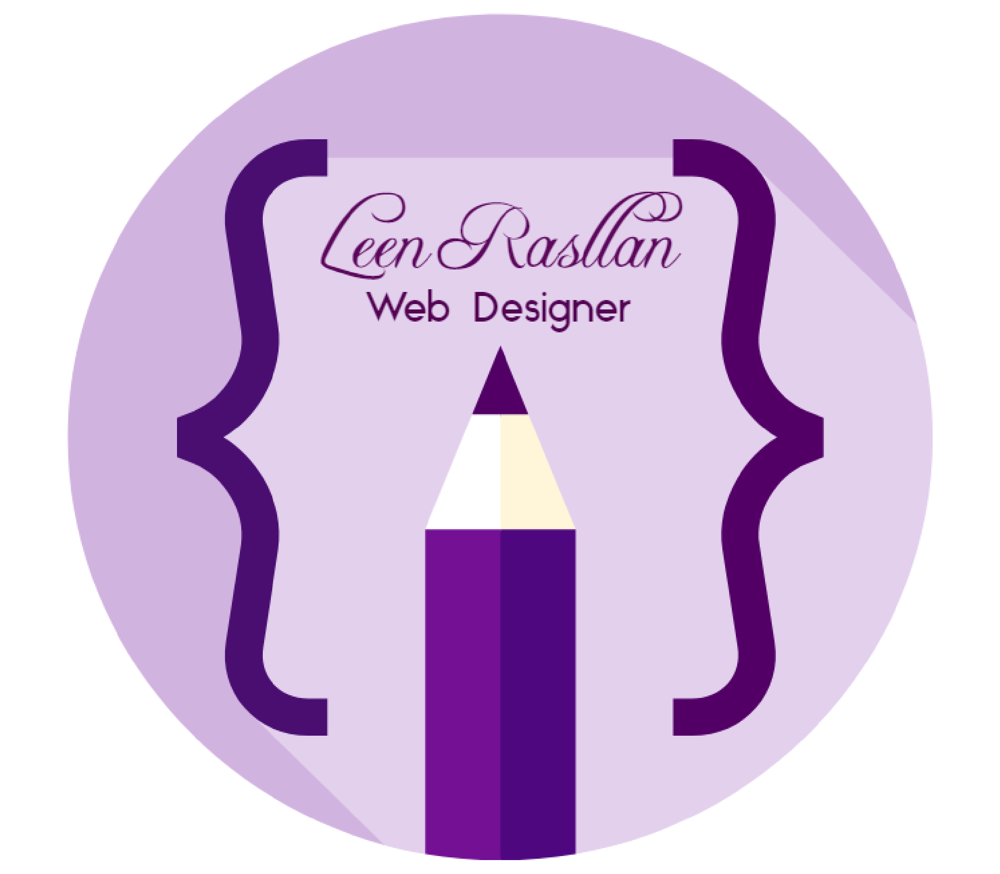

# my-notes
Hello 
## welcome to my app
#### I'm *Leen Rasllan*
I'm a ***Web Designer***  
 *I believe in the saying that*
 > “Life is like riding a bicycle. To keep your balance, you must ***keep moving***”...
 
### That's why I tried to learn many things
 such as  
  
 - Web design front end  
- Some of graphic skills  
- Some levels in English language  
- And a lot of courses in Quran science
 
 

 
 

[my first site](https://leen-rasllan.github.io/website/)

## Summury of Good Developer Mindset

        Development is a big concept has a lot of problems, and complicated. but there is some steps to make your work talk about his developer. The first thing is to analyze the requirement data ;it's important to create the perfect things for the users clear, uncomplicated ,easy, and developed easier, The practice make you avoid from the mistake and complicated the life isn't just work it must be like an art every one of us do his own touch you must to develop with your own touch the development is coding with design .Try to be clear simple easy and smart then misunderstanding can solved by planning ,analysis ,and discussion keep it simple and strong. Defining the problem is the way to creativity and to make it clear able to development and maintaining  . put the solution everywhere and the mistake over there, planning carefully and identify the important and the most important . you can't think about opening all the doors the small air currents will be a tornado...
